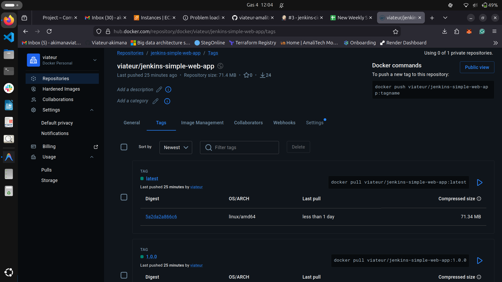
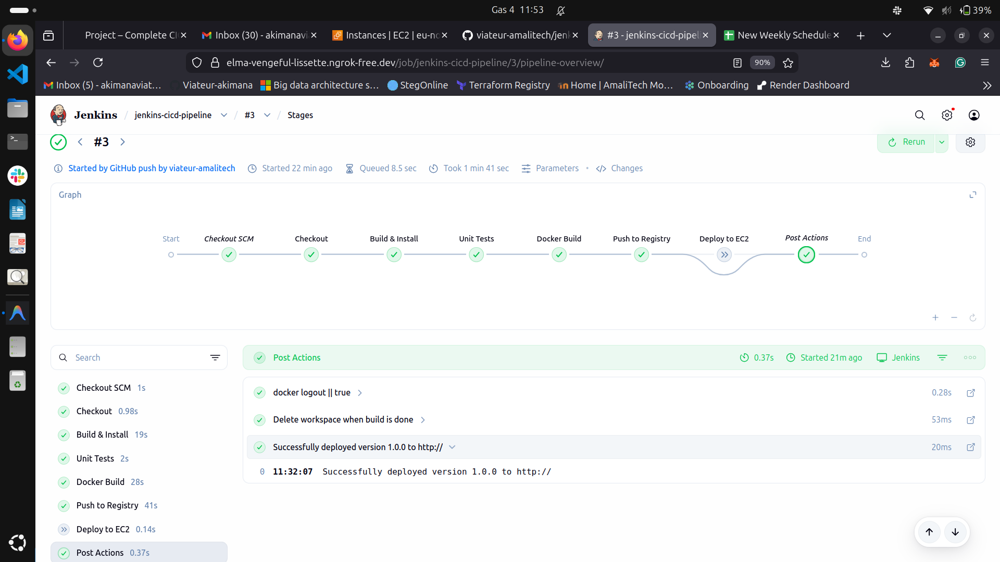

# 🚀 Professional Jenkins CI/CD Pipeline

An industry-standard, end-to-end CI/CD pipeline demonstrating the "Holy Trinity" of DevOps: **Infrastructure as Code** (Terraform), **Configuration as Code** (Ansible), and **Continuous Integration/Deployment** (Jenkins).

## 🌟 Project Overview

This project automates the entire lifecycle of a Node.js web application—from the first line of code to a live, production-ready server on AWS. It implements a robust, idempotent, and secure workflow that eliminates manual intervention.

---

## 🛠️ Technology Stack

| Category | Tools Used |
| :--- | :--- |
| **Application** | Node.js, Express, Jest |
| **Infrastructure** | Terraform, AWS (EC2, Elastic IP, Security Groups) |
| **Configuration** | Ansible (Modular Roles) |
| **CI/CD** | Jenkins LTS (Declarative Pipeline) |
| **Connectivity** | ngrok (for local Jenkins exposure) |
| **Registry** | Docker Hub |

---

## 🏗️ Architecture & Workflow

1.  **Infrastructure (Terraform)**: Provisions an AWS EC2 instance and assigns a **Static Elastic IP**.
2.  **Configuration (Ansible)**: Installs Docker, configures permissions, and manages the application lifecycle using modular roles (`docker`, `webapp`).
3.  **Pipeline (Jenkins)**:
    *   **Checkout**: Pulls code from GitHub.
    *   **Build & Install**: Handles Node.js dependencies.
    *   **Unit Tests**: Executes a Jest testing suite (Unit, Integration, E2E).
    *   **Docker Build**: Creates a versioned image with optimized layers.
    *   **Push**: Tags and pushes images to Docker Hub.
    *   **Deploy**: Orchestrates the Ansible playbook via SSH to update the live server.

---

## ✨ Key Industry Best Practices

*   **Zero Hardcoding**: 100% parameterized pipeline. Change IP, version, or repo without touching code.
*   **Modular Ansible**: Roles-based configuration for high maintainability.
*   **Secure Secrets**: Uses Jenkins `credentials()` and `sshagent` for masked, encrypted credential handling.
*   **Idempotency**: Ansible ensures the deployment won't break if run multiple times.
*   **Static Endpoint**: Elastic IP prevents endpoint changes upon server restarts.
*   **Local-to-Cloud Integration**: Uses **ngrok** to receive real-time GitHub webhooks on a local Jenkins server.

---

## 📸 Implementation Evidence

To fulfill the submission requirements, actual screenshots of the successful deployment are stored in the `/screenshots` folder.

### 1. Successful Jenkins Pipeline Run


*Figure 1: Jenkins stage view showing all stages (Checkout to Deploy) passing successfully.*

### 2. Live Application Accessibility


*Figure 2: Browser screenshot showing the application response via the Static Elastic IP.*

### 3. AWS EC2 Instance Status


*Figure 3: AWS Console showing the running EC2 instance with the associated Elastic IP.*

### 4. Docker Hub Registry


*Figure 4: Docker Hub repository containing the versioned and latest application images.*

### 5. Jenkins Pipeline Confirmation


*Figure 5: Jenkins dashboard showing the pipeline's successful build history and status.*

---

## 🚀 Getting Started

Detailed instructions for setting up Jenkins, AWS, and the Pipeline can be found in the:
👉 **[Full Runbook / Setup Guide](./runbook.md)**

### Quick Verification

Once deployed, the application is accessible at the static endpoint:
`http://13.60.151.71/`

---

## 📁 Repository Structure

```text
├── ansible/            # Modular Ansible Roles & Playbooks
├── terraform/          # Infrastructure as Code (AWS)
├── tests/              # Jest Testing Suite (Unit, Integration, E2E)
├── Jenkinsfile         # Parameterized CI/CD Definition
├── Dockerfile          # Optimized Container Specification
├── screenshots/        # Implementation Screenshots
└── runbook.md          # Step-by-Step Setup Guide
```


---

## 📄 License

This project is for demonstration and production-readiness training in DevOps engineering.
